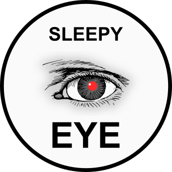
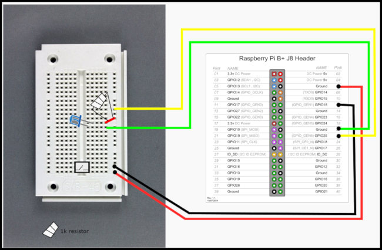

<h1>SLEEPY EYE</h1> 

   
This is a litte servery python script for recording camera footage with the Raspberry.
  
It is connected with a button and a LED over the GPIOs to start and stop the camera and to see its running status 

 
This is public domain. Play fair.
